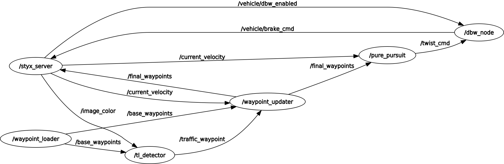
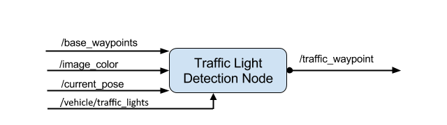
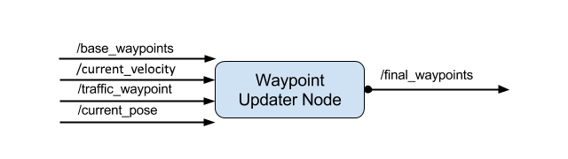

## Full Autonomous Vehicle Project

This is the project documentation for the Full Autonomous Vehicle Project provided by the Udacity Self Driving Car nanodegree.

The project aims to implement a full autonomous ROS based system capable on working in a controlled environment produced by a Udacity licensed simulator.

To see more information about different details of the implementation, please go to <strong><em>/docs/Documentation.md</em></strong>

## Getting started

This is the project repo for the final project of the Udacity Self-Driving Car Nanodegree: Programming a Real Self-Driving Car. For more information about the project, see the project introduction [here](https://classroom.udacity.com/nanodegrees/nd013/parts/6047fe34-d93c-4f50-8336-b70ef10cb4b2/modules/e1a23b06-329a-4684-a717-ad476f0d8dff/lessons/462c933d-9f24-42d3-8bdc-a08a5fc866e4/concepts/5ab4b122-83e6-436d-850f-9f4d26627fd9).

## System components

The full system consists of four modules:
- Perception module which is responsible for Obstacle and Traffic Light detection.
- Planning module which is responsible for Loading and Updating the waypoints of the cars path.
- Control module which is responsible for control nodes such as Drive-By-Wire node and Waypoint follower.
- Car module which takes all the information about the external environment and and information about the current states of the car.

<p align="center">
  
</p>

Here is a more detailed and low-level(ROS nodes and topics) representation of the system using rqt_graph GUI plugin for visualizing the ROS computation graph.

<p align="center">
  
</p>

## Custom contribution

To build a working environment having all the data provided by the car/simulator, I had to modify and implement three of the systems nodes. Those were as follow:
- Drive-By-Wire node
- Traffic Light Detector node
- Waypoint Updater node

### Drive-By-Wire node

This node provides the control of the car. 

This node had subscription to three topics:
```
- /current_velocity
- /twist_cmd
- /vehicle/dbw_enabled
```

Also, this node provides information for three another topics using publishing method:
```
- /vehicle/throttle_cmd
- /vehicle/steering_cmd
- /vehicle/brake_cmd
```

<p align="center">
  
</p>

The control was modeled using three controllers and a filter:
- PID Controller
- Twist controller
- Yaw controller
- Low Pass Filter 

### Traffic Light Detector node

This node provides information about the color states of the Traffic Lights.

This node had subscription to four topics:
```
- /base_waypoints
- /image_color
- /current_pose
- /vehicle/traffic_lights
```

Also, this node provides information for one another topic using publishing method:
```
- /traffic_waypoint
```

<p align="center">
  
</p>

To build this functionality, a trained SSD Inception V2 model was usd. For training, 200 custom images were used.
The network performs really well on the simulator having a high percent of accuracy at detecting RED and GREEN colors on the traffic lights. 

The images were taken from /image_color node which provides an image stream from the car's camera. Here is a RVIZ visualization of a traffic light image provided by /image_color node:

<p align="center">
  
</p>

To have a detection system without noise, I used a state_queue which takes in the last queue_size (10 in our case) detections and identify the most frequent state detected. Using this technique some errors in detection were dropped from the final decision.

Also, to have a smoother running the images that enter in Neural Networks inference were one at two images.

### Waypoint Updater node

This node provides information about the path that the car will follow.

This node had subscription to four topics:
```
- /base_waypoints
- /current_velocity
- /traffic_waypoints
- /current_pose
```

Also, this node provides information for one another topic using publishing method:
```
- /final_waypoints
```

<p align="center">
  
</p>

This one was the most difficult because having a lot of lag and lack of synchronization between the ROS system and unity simulator I had to optimize a lot of functionalities.

To modularize the waypoint updating process three different updating methods were used:
- waypoint initialization
- waypoint acceleration
- waypoint deceleration

Because the traffic light detection and its result in form of acceleration and deceleration introduced a lot of lag in the system I had to find a way to use a better optimized method for updating waypoints. 

The solution found here was to update only the delta-closest and delta-farthest waypoints from the current position because only there the differences occur. That method uses a queue of waypoints.

This is a visual representation of this method.

<p align="center">
  
</p>

- The waypoint initialization method used a linear increasing distribution of the speed from 0 to MAX_SPEED and this distribution was done over LOOKAHEAD_WPS waypoints.
- The waypoint acceleration method used the same linear increasing distribution of the speed but now from the previous velocity to MAX_SPEED.
- The waypoint decceleration method used a custom way of distributing the decreasing rate in the speed. 
Here, I had different approaches with different functions that were tested as it follows:

<p align="center">
  
</p>

The final solution provides a combination of the first (the linear deceleration) and the third (the sqrt deceleration) tested solutions to have a smooth deceleration.

Please use **one** of the two installation options, either native **or** docker installation.

### Native Installation

* Be sure that your workstation is running Ubuntu 16.04 Xenial Xerus or Ubuntu 14.04 Trusty Tahir. [Ubuntu downloads can be found here](https://www.ubuntu.com/download/desktop).
* If using a Virtual Machine to install Ubuntu, use the following configuration as minimum:
  * 2 CPU
  * 2 GB system memory
  * 25 GB of free hard drive space

  The Udacity provided virtual machine has ROS and Dataspeed DBW already installed, so you can skip the next two steps if you are using this.

* Follow these instructions to install ROS
  * [ROS Kinetic](http://wiki.ros.org/kinetic/Installation/Ubuntu) if you have Ubuntu 16.04.
  * [ROS Indigo](http://wiki.ros.org/indigo/Installation/Ubuntu) if you have Ubuntu 14.04.
* [Dataspeed DBW](https://bitbucket.org/DataspeedInc/dbw_mkz_ros)
  * Use this option to install the SDK on a workstation that already has ROS installed: [One Line SDK Install (binary)](https://bitbucket.org/DataspeedInc/dbw_mkz_ros/src/81e63fcc335d7b64139d7482017d6a97b405e250/ROS_SETUP.md?fileviewer=file-view-default)
* Download the [Udacity Simulator](https://github.com/udacity/CarND-Capstone/releases).

### Docker Installation
[Install Docker](https://docs.docker.com/engine/installation/)

Build the docker container
```bash
docker build . -t capstone
```

Run the docker file
```bash
docker run -p 4567:4567 -v $PWD:/capstone -v /tmp/log:/root/.ros/ --rm -it capstone
```

### Port Forwarding
To set up port forwarding, please refer to the "uWebSocketIO Starter Guide" found in the classroom (see Extended Kalman Filter Project lesson).

### Usage

1. Clone the project repository
```bash
git clone https://github.com/udacity/CarND-Capstone.git
```

2. Install python dependencies
```bash
cd CarND-Capstone
pip install -r requirements.txt
```
3. Make and run styx
```bash
cd ros
catkin_make
source devel/setup.sh
roslaunch launch/styx.launch
```
4. Run the simulator

### Real world testing
1. Download [training bag](https://s3-us-west-1.amazonaws.com/udacity-selfdrivingcar/traffic_light_bag_file.zip) that was recorded on the Udacity self-driving car.
2. Unzip the file
```bash
unzip traffic_light_bag_file.zip
```
3. Play the bag file
```bash
rosbag play -l traffic_light_bag_file/traffic_light_training.bag
```
4. Launch your project in site mode
```bash
cd CarND-Capstone/ros
roslaunch launch/site.launch
```
5. Confirm that traffic light detection works on real life images

### Other library/driver information
Outside of `requirements.txt`, here is information on other driver/library versions used in the simulator and Carla:

Specific to these libraries, the simulator grader and Carla use the following:

|        | Simulator | Carla  |
| :-----------: |:-------------:| :-----:|
| Nvidia driver | 384.130 | 384.130 |
| CUDA | 8.0.61 | 8.0.61 |
| cuDNN | 6.0.21 | 6.0.21 |
| TensorRT | N/A | N/A |
| OpenCV | 3.2.0-dev | 2.4.8 |
| OpenMP | N/A | N/A |

We are working on a fix to line up the OpenCV versions between the two.
