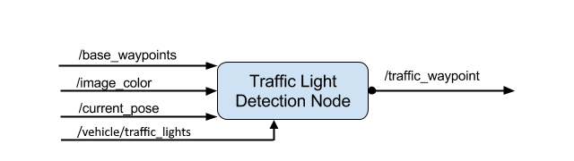

## Overview

This is the project documentation for the Full Autonomous Vehicle Project provided by the Udacity Self Driving Car nanodegree.

The project aims to implement a full autonomous ROS based system.

## System components

The full system consists of four modules:
- Perception module which is responsible for Obstacle and Traffic Light detection.
- Planning module which is responsible for Loading and Updating the waypoints of the cars path.
- Control module which is responsible for control nodes such as Drive-By-Wire node and Waypoint follower.
- Car module which takes all the information about the external environment and and information about the current states of the car.

  

Here is a more detailed and low-level(ROS nodes and topics) representation of the system using rqt_graph GUI plugin for visualizing the ROS computation graph.

  

## Custom contribution

To build a working environment having all the data provided by the car/simulator, I had to modify and implement three of the systems nodes. Those were as follow:
- Drive-By-Wire node
- Traffic Light Detector node
- Waypoint Updater node

### Drive-By-Wire node

This node provides the control of the car. 

This node had subscription to three topics:
- /current_velocity
- /twist_cmd
- /vehicle/dbw_enabled

Also, this node provides information for three another topics using publishing method:
- /vehicle/throttle_cmd
- /vehicle/steering_cmd
- /vehicle/brake_cmd

  

The control was modeled using three controllers and a filter:
- PID Controller
- Twist controller
- Yaw controller
- Low Pass Filter 

### Traffic Light Detector node

This node provides information about the color states of the Traffic Lights.

This node had subscription to four topics:
- /base_waypoints
- /image_color
- /current_pose
- /vehicle/traffic_lights

Also, this node provides information for one another topic using publishing method:
- /traffic_waypoint

  

To build this functionality, a trained SSD Inception V2 model was usd. For training, 200 custom images were used.
The network performs really well on the simulator having a high percent of accuracy at detecting RED and GREEN colors on the traffic lights. 

The images were taken from /image_color node which provides an image stream from the car's camera. Here is a RVIZ visualization of a traffic light image provided by /image_color node:

  

To have a detection system without noise, I used a state_queue which takes in the last queue_size (10 in our case) detections and identify the most frequent state detected. Using this technique some errors in detection were dropped from the final decision.

Also, to have a smoother running the images that enter in Neural Networks inference were one at two images.

### Waypoint Updater node

This node provides information about the path that the car will follow.

  

This one was the most difficult because having a lot of lag and lack of synchronization between the ROS system and unity simulator I had to optimize a lot of functionalities.

To modularize the waypoint updating process three different updating methods were used:
- waypoint initialization
- waypoint acceleration
- waypoint deceleration

Because the traffic light detection and its result in form of acceleration and deceleration introduced a lot of lag in the system I had to find a way to use a better optimized method for updating waypoints. 

The solution found here was to update only the delta-closest and delta-farthest waypoints from the current position because only there the differences occur. That method uses a queue of waypoints.

This is a visual representation of this method.

  

- The waypoint initialization method used a linear increasing distribution of the speed from 0 to MAX_SPEED and this distribution was done over LOOKAHEAD_WPS waypoints.
- The waypoint acceleration method used the same linear increasing distribution of the speed but now from the previous velocity to MAX_SPEED.
- The waypoint decceleration method used a custom way of distributing the decreasing rate in the speed. 
Here, I had different approaches with different functions that were tested as it follows:

  

The final solution provides a combination of the first and the third tested solutions to have a smooth deceleration

